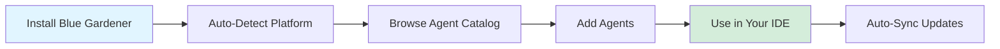

# What is Blue Gardener?

Blue Gardener is a CLI tool that manages AI coding agents across multiple platforms. It helps you install, organize, and maintain specialized AI agents that enhance your development workflow.

## Why Blue Gardener?

### Multi-Platform Support

Different AI coding platforms use different formats for agents:

- Cursor uses `.cursor/agents/*.md`
- Claude Desktop uses `.claude/agents/*.md`
- Codex uses a single `AGENTS.md` file
- GitHub Copilot uses `.github/copilot-instructions.md`
- Windsurf uses `.windsurf/rules/*.md`
- OpenCode uses `.opencode/agents/*.md`

Blue Gardener handles all these formats automatically, so you can focus on using agents rather than managing platform differences.

### 44 Specialized Agents

Blue Gardener includes a comprehensive collection of agents:

- **Orchestrators (5)** - Coordinate complex workflows
- **Development (9)** - Build features across stacks
- **Quality (9)** - Ensure code quality and standards
- **Infrastructure (9)** - Manage CI/CD and tooling
- **Configuration (1)** - Set up AI platforms
- **Blockchain (11)** - Smart contract development

[Browse the full catalog →](/agents/)

### Orchestration Patterns

Agents don't work in isolation - they collaborate following proven patterns:

- **Feature Development** - Specification → Architecture → Implementation → Review
- **Quality Assurance** - Review → Fix → Verify (iterative)
- **Refactoring** - Strategy → Phases → Verification
- **Backend Development** - Architecture → Database → Implementation → Review

[Learn orchestration →](/guide/orchestration)

## How It Works



1. **Install** - Add Blue Gardener to your project
2. **Auto-Detect** - Automatically detects your AI platform (Cursor, Claude, etc.)
3. **Browse** - Explore agents by category
4. **Add** - Select and install agents
5. **Use** - Invoke agents in your IDE (e.g., `@blue-react-developer`)
6. **Sync** - Keep agents updated automatically

## Key Features

### Category-Based Selection

When you run `blue-gardener add`, you first select a category:

```
? Select a category:
  > Orchestrators (5 agents)
    Development (9 agents)
    Quality (9 agents)
    Infrastructure (9 agents)
    Configuration (1 agent)
    Blockchain (11 agents)
```

Then browse agents within that category.

### Smart Search

Find agents quickly:

::: code-group

```bash [npm]
npx blue-gardener search react
npx blue-gardener search testing
```

```bash [pnpm]
pnpm blue-gardener search react
pnpm blue-gardener search testing
```

```bash [yarn]
yarn blue-gardener search react
yarn blue-gardener search testing
```

:::

### Auto-Sync

When you update Blue Gardener, installed agents automatically update to their latest versions:

::: code-group

```bash [npm]
npm update blue-gardener
# Agents auto-sync on next use
```

```bash [pnpm]
pnpm update blue-gardener
# Agents auto-sync on next use
```

```bash [yarn]
yarn upgrade blue-gardener
# Agents auto-sync on next use
```

:::

## Next Steps

<div class="next-steps">

**[Installation →](/guide/installation)**  
Install Blue Gardener in your project

**[First Steps →](/guide/first-steps)**  
Set up your first agents

**[Platforms →](/guide/platforms)**  
Learn about supported platforms

</div>

<style>
.next-steps {
  display: grid;
  grid-template-columns: repeat(auto-fit, minmax(200px, 1fr));
  gap: 1rem;
  margin-top: 2rem;
}
</style>
