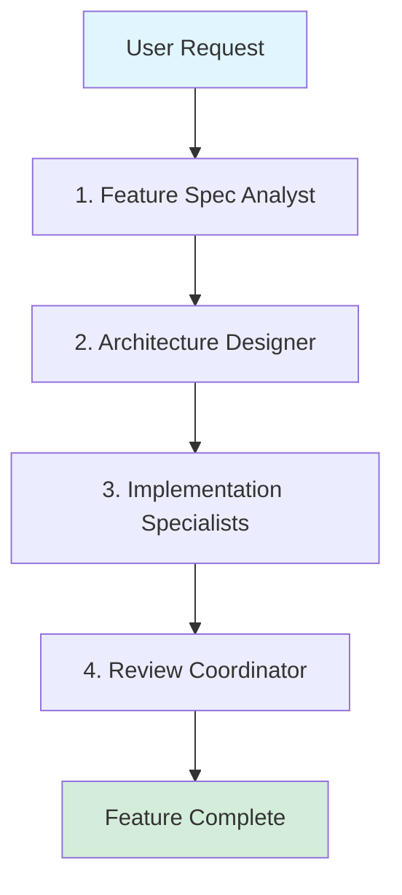
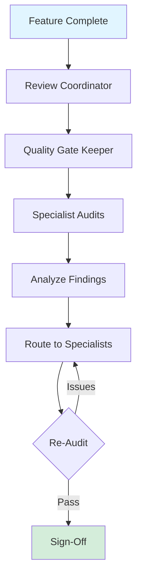
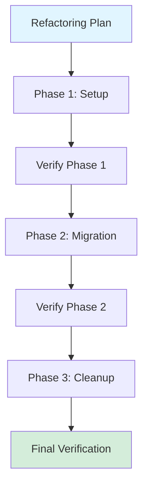
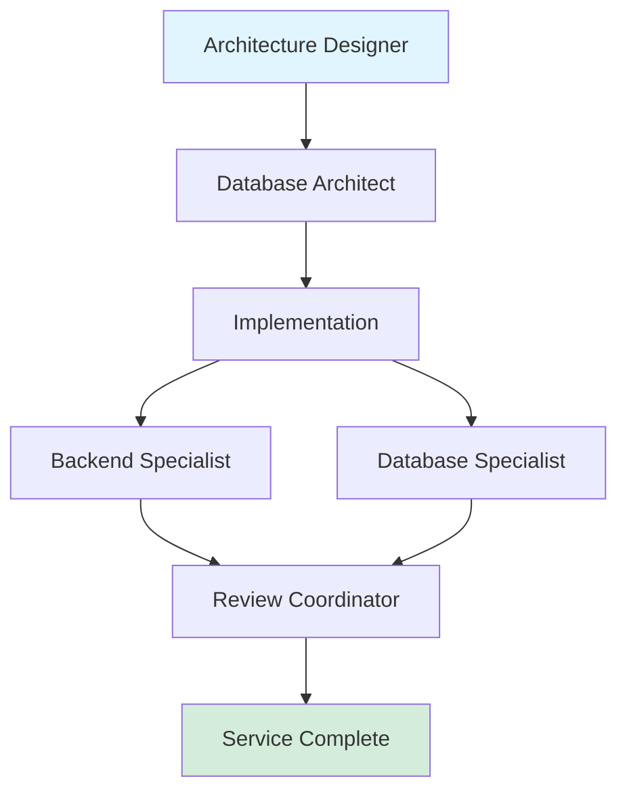

# Orchestration Patterns

Blue Gardener agents work together following proven orchestration patterns. This guide shows you how to coordinate multiple agents for complex workflows.

## Agent Types

### Orchestrators

Coordinate workflows and delegate to specialists:

- `blue-feature-specification-analyst` - Requirements & planning
- `blue-architecture-designer` - Technical design
- `blue-refactoring-strategy-planner` - Refactoring strategy
- `blue-app-quality-gate-keeper` - Quality audits
- `blue-implementation-review-coordinator` - Review coordination

### Specialists

Execute specific tasks in their domain:

- **Development** (9 agents) - Build features
- **Quality** (9 agents) - Ensure code quality
- **Infrastructure** (9 agents) - DevOps & tooling
- **Blockchain** (11 agents) - Smart contracts
- **Configuration** (1 agent) - Platform setup

[View all agents →](/agents/)

## Core Patterns

### Pattern 1: Feature Development

**Use when:** Building new features from requirements to release



**Flow:**

1. **@blue-feature-specification-analyst**
   - Clarifies requirements
   - Defines acceptance criteria
   - Creates implementation plan

2. **@blue-architecture-designer**
   - Designs technical approach
   - Recommends technologies
   - Identifies needed specialists

3. **Implementation Specialists** (parallel)
   - @blue-react-developer (frontend)
   - @blue-node-backend-implementation-specialist (backend)
   - @blue-api-integration-expert (API layer)

4. **@blue-implementation-review-coordinator**
   - Runs quality audits
   - Routes fixes to specialists
   - Iterates until standards met

### Pattern 2: Quality Assurance

**Use when:** Verifying code quality before releases



**Flow:**

1. **@blue-implementation-review-coordinator**
   - Coordinates review process
   - Manages feedback loops

2. Delegates to **@blue-app-quality-gate-keeper**
   - Runs comprehensive audits
   - Coordinates specialist reviews

3. **Specialist Audits** (parallel)
   - @blue-frontend-code-reviewer (code quality)
   - @blue-security-specialist (security)
   - @blue-performance-specialist (performance)
   - @blue-accessibility-specialist (accessibility)

4. **Route Fixes**
   - Issues sent back to implementation specialists
   - Iterative fix-verify cycles

5. **Final Sign-Off**
   - All critical issues resolved
   - Quality standards met

### Pattern 3: Refactoring

**Use when:** Planning large-scale code changes



**Flow:**

1. **@blue-refactoring-strategy-planner**
   - Analyzes current state
   - Creates phased plan
   - Identifies risks

2. **Phase 1: Setup**
   - Preparation work
   - Add abstractions
   - Write tests

3. **@blue-implementation-review-coordinator**
   - Verify phase 1 complete
   - Check for regressions

4. **Phase 2: Migration**
   - Incremental changes
   - Coexistence period

5. **Verify Phase 2**
   - Quality checks
   - Behavior preservation

6. **Phase 3: Cleanup**
   - Remove old code
   - Final optimizations

7. **Final Verification**
   - Complete quality audit
   - Sign-off

### Pattern 4: Backend Development

**Use when:** Building backend services



**Flow:**

1. **@blue-architecture-designer**
   - System design
   - Database selection

2. **@blue-database-architecture-specialist**
   - Schema design
   - Scaling strategy

3. **Implementation** (parallel)
   - @blue-node-backend-implementation-specialist (API)
   - @blue-relational-database-specialist (database)

4. **@blue-implementation-review-coordinator**
   - Code quality review
   - Security audit
   - Performance check

## Complexity Scaling

| Task           | Agents | Example                                                     |
| -------------- | ------ | ----------------------------------------------------------- |
| **Trivial**    | 1-2    | Bug fix: developer + reviewer                               |
| **Simple**     | 2-3    | Small feature: developer + stylist + reviewer               |
| **Standard**   | 4-6    | Feature: spec + arch + implementation + review              |
| **Complex**    | 7-9    | Major feature: add security, testing, performance           |
| **Enterprise** | 10+    | Full release: all orchestrators + comprehensive specialists |

## Best Practices

### Start with Orchestrators

For complex work, begin with planning orchestrators:

✅ **Good:**

```
1. @blue-feature-specification-analyst analyze this requirement
2. @blue-architecture-designer design the system
3. Implementation with specialists
4. @blue-implementation-review-coordinator verify quality
```

❌ **Bad:**

```
Jump straight to implementation without planning
```

### Use Parallel Execution

When specialists can work independently:

```
@blue-react-developer     → Build components
@blue-ui-styling-specialist → Style components  } Execute simultaneously
@blue-state-management-expert → Set up state
```

### Iterate Through Quality Checks

Allow feedback cycles:

```
Implementation → Review → Fix → Re-Review → Sign-off
```

Don't skip iterations when issues are found.

### Escalate Appropriately

Know when to involve the user:

- Multiple valid approaches (architectural decisions)
- Ambiguous requirements
- Persistent quality issues after multiple iterations
- Trade-offs requiring user input

## Real-World Examples

### Example 1: Building Authentication

```
User: "Build user authentication with email and password"

1. @blue-feature-specification-analyst
   → Clarifies: session management, password rules, forgot password, etc.

2. @blue-architecture-designer
   → Designs: JWT tokens, refresh flow, database schema

3. Implementation (parallel):
   → @blue-react-developer: Login/signup forms
   → @blue-node-backend-implementation-specialist: Auth API
   → @blue-security-specialist: Secure password hashing

4. @blue-implementation-review-coordinator
   → Security audit critical
   → Accessibility check on forms
   → Code review
   → Sign-off when standards met
```

### Example 2: Performance Optimization

```
User: "App is slow, please optimize"

1. @blue-performance-specialist
   → Analyzes: bundle size, render performance, API calls
   → Identifies: issues and optimization opportunities

2. Implementation:
   → @blue-react-developer: Code splitting, memoization
   → @blue-api-integration-expert: Request optimization

3. @blue-implementation-review-coordinator
   → Verifies: performance improvements
   → Ensures: no regressions
   → Measures: metrics before/after
```

### Example 3: Database Migration

```
User: "Migrate from MongoDB to PostgreSQL"

1. @blue-refactoring-strategy-planner
   → Creates phased migration plan
   → Identifies risks

2. @blue-database-architecture-specialist
   → Designs PostgreSQL schema
   → Plans data migration

3. Phase 1: Dual-write setup
   → @blue-node-backend-implementation-specialist

4. @blue-implementation-review-coordinator: Verify Phase 1

5. Phase 2: Migrate reads
6. Verify Phase 2
7. Phase 3: Remove MongoDB
8. Final verification
```

## Troubleshooting

### Too Many Agents Involved

**Problem:** Workflow becoming complex

**Solution:** Scale back to fewer orchestrators. For simple tasks, use specialists directly.

### Issues Recurring Across Iterations

**Problem:** Same issues after multiple fix cycles

**Solution:** Escalate to architecture designer - likely an architectural problem.

### Unclear Which Orchestrator to Use

**Problem:** Don't know where to start

**Solution:** Default to `@blue-feature-specification-analyst` - it will delegate to others as needed.

## Next Steps

**[Agent Catalog →](/agents/)**  
Browse all agents and their capabilities

**[CLI Reference →](/reference/cli)**  
Complete command documentation
