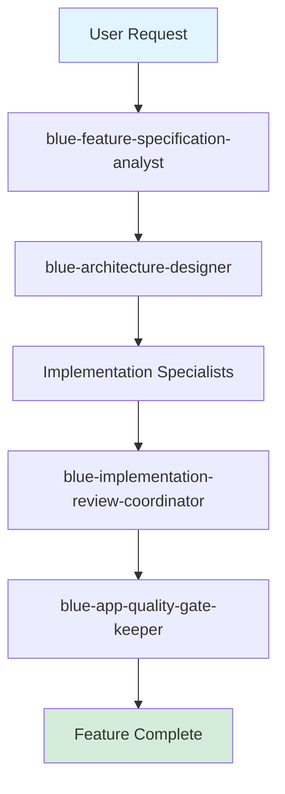

## Quick Start

Install Blue Gardener in your project:

::: code-group

```bash [npm]
npm install -D blue-gardener
```

```bash [pnpm]
pnpm add -D blue-gardener
```

```bash [yarn]
yarn add -D blue-gardener
```

:::

Run the interactive menu:

::: code-group

```bash [npm]
npx blue-gardener
```

```bash [pnpm]
pnpm blue-gardener
```

```bash [yarn]
yarn blue-gardener
```

:::

## What is Blue Gardener?

Blue Gardener is a CLI tool that manages AI coding agents across multiple platforms. It provides:

- **44 specialized agents** covering orchestration, development, quality, infrastructure, and blockchain
- **Platform adapters** that work with 6 different AI coding platforms
- **Category-based selection** for easy discovery
- **Auto-sync** to keep agents updated
- **Orchestration patterns** for complex workflows

## Supported Platforms

- **Cursor** - Native agent support in `.cursor/agents/`
- **Claude Desktop** - MCP agents in `.claude/agents/`
- **Codex** - OpenAI Codex with `AGENTS.md` file
- **GitHub Copilot** - Custom instructions in `.github/copilot-instructions.md`
- **Windsurf** - Cascade rules in `.windsurf/rules/`
- **OpenCode** - Custom agents in `.opencode/agents/`

[Learn more about platforms →](/guide/platforms)

## Agent Categories

- **Orchestrators (5)** - Planning, coordination, and quality assurance
- **Development (9)** - React, state management, styling, API integration
- **Quality (9)** - Code review, testing, accessibility, performance, security
- **Infrastructure (9)** - GitHub Actions, CLI development, databases, Docker
- **Configuration (1)** - Multi-platform AI setup
- **Blockchain (11)** - Smart contracts, DeFi, Web3 integration

[Browse all agents →](/agents/)

## Example: Feature Development Flow



[Learn orchestration patterns →](/guide/orchestration)
